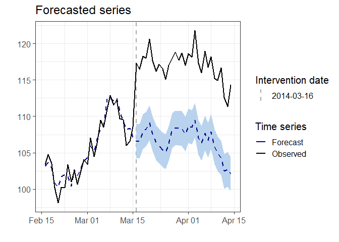
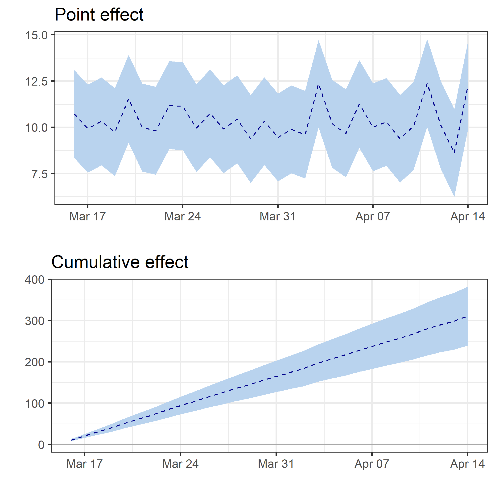
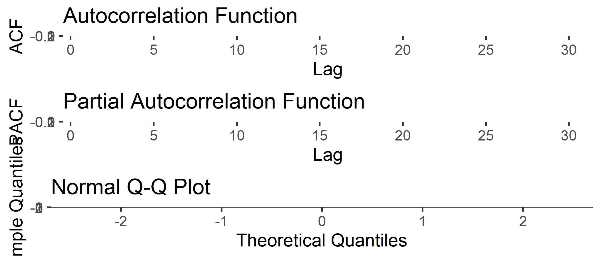

<!-- README.md is generated from README.Rmd. Please edit that file -->

# CausalArima

<!-- badges: start -->

<!-- badges: end -->

The goal of CausalArima is to estimates the causal effect of an
intervention on a univariate time series using ARIMA models.

## Installation

<!-- You can install the released version of CausalArima from [CRAN](https://CRAN.R-project.org) with: -->

<!-- ``` r -->

<!-- install.packages("CausalArima") -->

<!-- ``` -->

You can install the development version of CausalArima from from
[GitHub](https://github.com/) with:

``` r
# install.packages("devtools")
devtools::install_github("FMenchetti/CausalArima")
```

## Example

This is a basic example which shows you how to use the package:

``` r
library(CausalArima)
#> Loading required package: forecast
#> Registered S3 method overwritten by 'quantmod':
#>   method            from
#>   as.zoo.data.frame zoo
#> Loading required package: ggplot2
#> Loading required package: gridExtra
#> 
#> Attaching package: 'CausalArima'
#> The following object is masked from 'package:base':
#> 
#>     table

# simulate data
n<-100
set.seed(1)
x1 <- 100 + arima.sim(model = list(ar = 0.999), n = n)
y <- 1.2 * x1 + rnorm(n)
y[ floor(n*.71):n] <- y[ floor(n*.71):n] + 10
data <- cbind(y, x1)
dates <- seq.Date(from = as.Date("2014-01-05"), by = "days", length.out = n)
start<-as.numeric(strftime(as.Date(dates[1], "%Y-%m-%d"), "%u"))

# Adding a fictional intervention
int.date <- as.Date("2014-03-161")

# fit the model - Causal effect estimation
ce <- CausalArima(y = ts(y, start = start, frequency = 1), auto = TRUE, ic = "aicc", dates = dates, int.date = int.date,
                  xreg =x1)
```

How to obtain the plot of the forecast:

``` r
forecasted<-plot(ce, type="forecast", printing=FALSE)
forecasted
```



How to obtain the plot of the estimated effects and cumulative effects:

``` r

impact<-plot(ce, type="impact", printing=FALSE)
grid.arrange(impact$plot, impact$cumulative_plot)
```



How to obtain the estimates of the effects:

``` r
print(ce)
#>                                       
#> Point causal effect            12.257 
#> Standard error                 1.211  
#> Left-sided p-value             1      
#> Bidirectional p-value          0      
#> Right-sided p-value            0      
#>                                       
#> Cumulative causal effect       310.709
#> Standard error                 6.634  
#> Left-sided p-value             1      
#> Bidirectional p-value          0      
#> Right-sided p-value            0      
#>                                       
#> Temporal average causal effect 10.357 
#> Standard error                 0.221  
#> Left-sided p-value             1      
#> Bidirectional p-value          0      
#> Right-sided p-value            0
table(ce)
#>     2014-04-14 
#> avg 10.36^{***}
#> sd  (0.22)
```

How to inspect the residuals, with the plots of autocorrelation (ACF)
and partial autocorrelation (PACF) functions and QQ-plots:

``` r
residuals<-plot(ce, type="residuals", printing=FALSE)
grid.arrange(residuals$ACF, residuals$PACF, residuals$QQ_plot)
```


