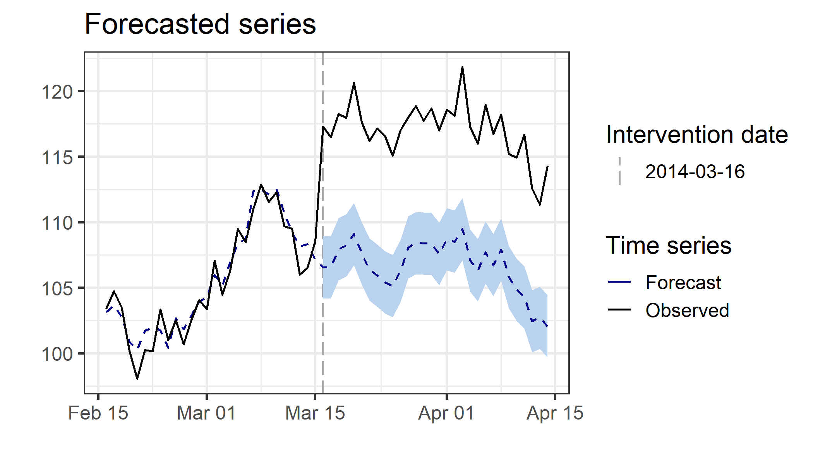
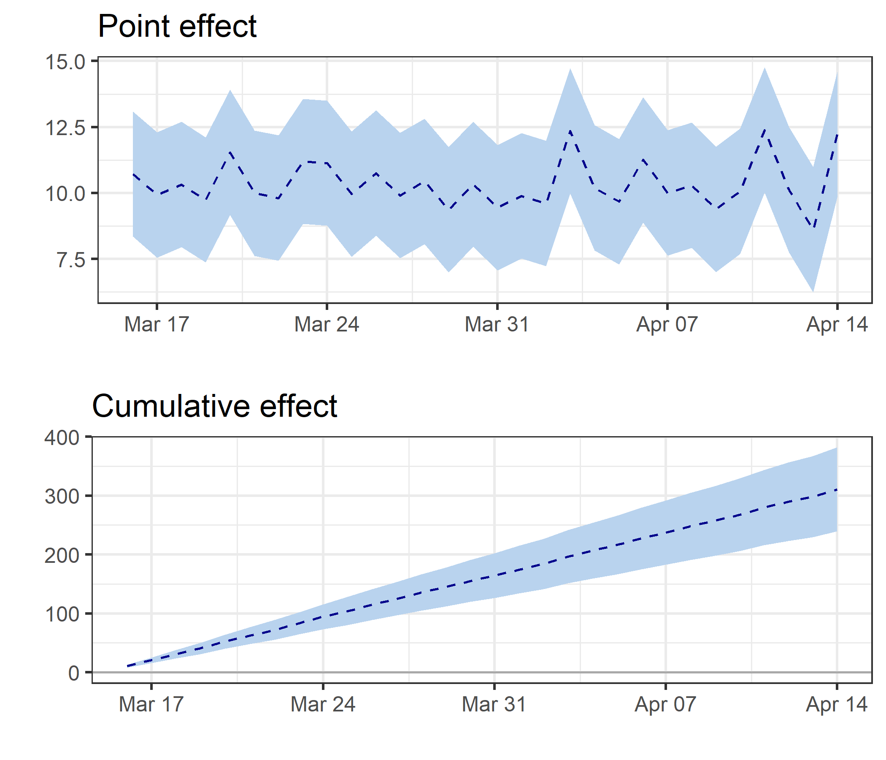
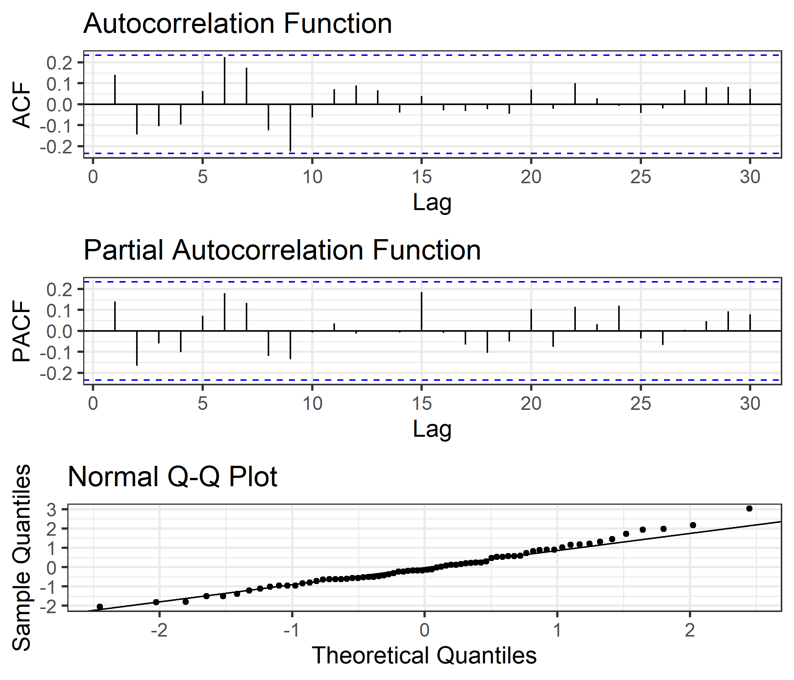

<!-- README.md is generated from README.Rmd. Please edit that file -->

# CausalArima

<!-- badges: start -->

<!-- badges: end -->

The goal of CausalArima is to estimates the causal effect of an
intervention on a univariate time series using ARIMA models.

## Installation

<!-- You can install the released version of CausalArima from [CRAN](https://CRAN.R-project.org) with: -->

<!-- ``` r -->

<!-- install.packages("CausalArima") -->

<!-- ``` -->

You can install the development version of CausalArima from from
[GitHub](https://github.com/) with:

``` r
# install.packages("devtools")
devtools::install_github("FMenchetti/CausalArima")
```

## Example

This is a basic example which shows you how to use the package:

``` r
library(CausalArima)
#> Loading required package: forecast
#> Registered S3 method overwritten by 'quantmod':
#>   method            from
#>   as.zoo.data.frame zoo
#> Loading required package: ggplot2
#> Loading required package: tidybayes
#> Loading required package: gridExtra

# simulate data
n<-100
set.seed(1)
x1 <- 100 + arima.sim(model = list(ar = 0.999), n = n)
y <- 1.2 * x1 + rnorm(n)
y[ floor(n*.71):n] <- y[ floor(n*.71):n] + 10
data <- cbind(y, x1)
dates <- seq.Date(from = as.Date("2014-01-05"), by = "days", length.out = n)
start<-as.numeric(strftime(as.Date(dates[1], "%Y-%m-%d"), "%u"))

# Adding a fictional intervention
int.date <- as.Date("2014-03-161")

# fit the model - Causal effect estimation
ce <- CausalArima(y = ts(y, start = start, frequency = 1), auto = TRUE, ic = "aicc", dates = dates, int.date = int.date,
                  xreg =x1)
```

How to obtain the plot of the forecast:

``` r
forecasted<-plot(ce, type="forecast", printing=FALSE)
forecasted
```

<!-- -->

How to obtain the plot of the estimated effects and cumulative effects:

``` r

impact<-plot(ce, type="impact", printing=FALSE)
grid.arrange(impact$plot, impact$cumulative_plot)
```

<!-- -->

How to obtain a summary of the model:

``` r
summary_model<-CoefficientsTable(ce, printing=TRUE)
#> Arima Order:
#> p d q 
#> 0 0 0 
#>          coef          se
#> xreg 1.199333 0.001658076
#> 
#>    loglik       aic       bic      aicc 
#> -112.2340  228.4681  232.9651  228.6472 
#> 
#>                       ME     RMSE       MAE          MPE      MAPE      MASE
#> Training set 0.004322758 1.202502 0.9464393 -0.005170545 0.9072633 0.5734012
#>                   ACF1
#> Training set 0.1407503
```

How to obtain extimates of the average and cunulative effects:

``` r
ResultTable(ce)
#>        2014-04-14
#> avg    12.26***  
#> avg.sd (1.21)    
#> sum    10.36***  
#> sum.sd (0.22)    
#> tau    310.71*** 
#> tau.sd (6.63)
```

How to inspect the residuals, with the plots of autocorrelation (ACF)
and partial autocorrelation (PACF) functions and QQ-plots:

``` r
residuals<-plot(ce, type="residuals", printing=FALSE)
grid.arrange(residuals$ACF, residuals$PACF, residuals$QQ_plot)
```

<!-- -->

## Modify the plots

The plotting functions have some graphical parameters that make easier
to personalize the plots:

``` r
forecasted_2<-plot(ce, type="forecast", printing=FALSE, fill_colour="orange",
               colours=c("red", "blue"))
forecasted_2
```

<!-- -->

All plotting functions return a ggplot object or a list of ggplot
objects, which makes easy to modify any ggplot parameters of the theme
([here](https://ggplot2.tidyverse.org/reference/theme.html) a reference
to the many ggplot parameters that can be modified):

``` r
forecasted+ theme(legend.text = element_text(size=8, colour = "red", family ="mono"),
                legend.title = element_text(size=9, colour = "blue", family ="sans"),
                title= element_text(size=15, colour = "green", family ="serif"),
                axis.line=element_line(size=2, colour="yellow"),
                legend.position = "bottom"
                )
```

<!-- -->

The ggthemes package can be useful to employ directly some
pre-customized themes, for example we can use the Wall Street Journal
theme simply typing:

``` r
library(ggthemes)
forecasted+theme_wsj()
```

<!-- -->

## Learn more

You can read more on [Estimating the causal effect of an intervention in
a time series setting: the C-ARIMA
approach](https://arxiv.org/abs/2103.06740) (Fiammetta Menchetti,
Fabrizio Cipollini, Fabrizia Mealli, 2021).

It is also available on youtube a video of a webinar on the topic:
[Fiammetta Menchetti: Estimating the causal effect of an intervention in
a time series setting](https://www.youtube.com/watch?v=RjMEtv3C5S0).
