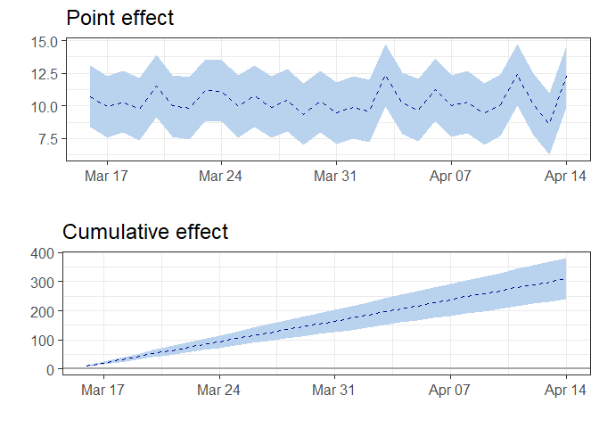

<!-- README.md is generated from README.Rmd. Please edit that file -->

# CausalArima

<!-- badges: start -->

<!-- badges: end -->

The goal of CausalArima is to estimates the causal effect of an
intervention on a univariate time series using ARIMA models.

## Installation

<!-- You can install the released version of CausalArima from [CRAN](https://CRAN.R-project.org) with: -->

<!-- ``` r -->

<!-- install.packages("CausalArima") -->

<!-- ``` -->

You can install the development version of CausalArima from from
[GitHub](https://github.com/) with:

``` r
# install.packages("devtools")
devtools::install_github("FMenchetti/CausalArima")
```

## Example

This is a basic example which shows you how to use the package:

``` r
library(CausalArima)
#> Loading required package: forecast
#> Registered S3 method overwritten by 'quantmod':
#>   method            from
#>   as.zoo.data.frame zoo
#> Loading required package: ggplot2
#> Loading required package: gridExtra
#> 
#> Attaching package: 'CausalArima'
#> The following object is masked from 'package:base':
#> 
#>     table

# simulate data
n<-100
set.seed(1)
x1 <- 100 + arima.sim(model = list(ar = 0.999), n = n)
y <- 1.2 * x1 + rnorm(n)
y[ floor(n*.71):n] <- y[ floor(n*.71):n] + 10
data <- cbind(y, x1)
dates <- seq.Date(from = as.Date("2014-01-05"), by = "days", length.out = n)
start<-as.numeric(strftime(as.Date(dates[1], "%Y-%m-%d"), "%u"))

# Adding a fictional intervention
int.date <- as.Date("2014-03-161")

# fit the model - Causal effect estimation
ce <- CausalArima(y = ts(y, start = start, frequency = 1), auto = TRUE, ic = "aicc", dates = dates, int.date = int.date,
                  xreg =x1)
```

``` r
fore<-plot(ce, type="forecast")
```


``` r
impact<-plot(ce, type="impact")
```



    #> TableGrob (2 x 1) "arrange": 2 grobs
    #>                 z     cells    name           grob
    #> plot            1 (1-1,1-1) arrange gtable[layout]
    #> cumulative_plot 2 (2-2,1-1) arrange gtable[layout]
    table(ce)
    #>     2014-04-14 
    #> avg 10.36^{***}
    #> sd  (0.22)

``` r
residuals<-plot(ce, type="residuals")
```


    #> TableGrob (3 x 1) "arrange": 3 grobs
    #>         z     cells    name           grob
    #> ACF     1 (1-1,1-1) arrange gtable[layout]
    #> PACF    2 (2-2,1-1) arrange gtable[layout]
    #> QQ_plot 3 (3-3,1-1) arrange gtable[layout]
