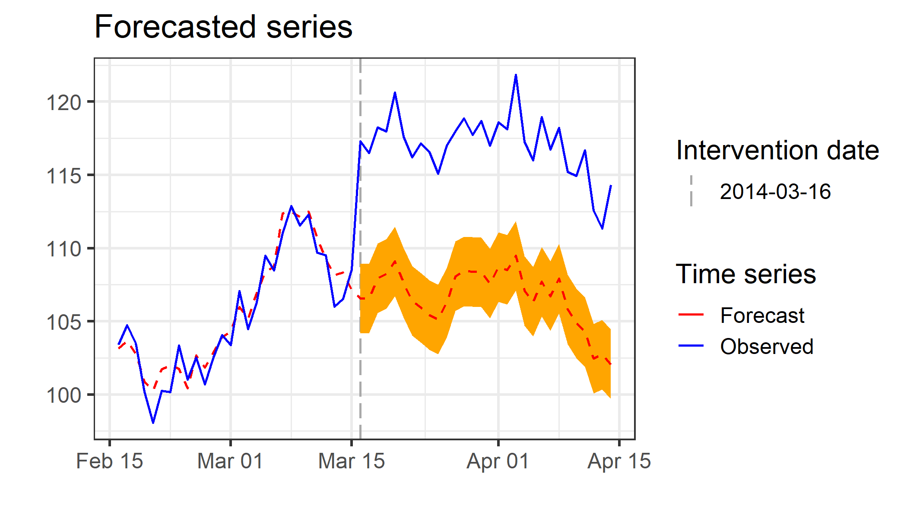
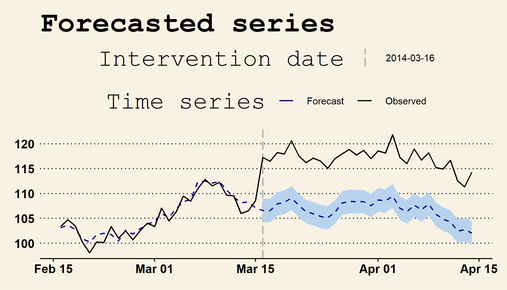

<!-- README.md is generated from README.Rmd. Please edit that file -->

# CausalArima

<!-- badges: start -->
<!-- badges: end -->

The goal of CausalArima is to estimate the causal effect of an
intervention on a univariate time series using ARIMA models.

## Installation

<!-- You can install the released version of CausalArima from [CRAN](https://CRAN.R-project.org) with: -->
<!-- ``` r -->
<!-- install.packages("CausalArima") -->
<!-- ``` -->

You can install the development version of CausalArima from
[GitHub](https://github.com/) with:

``` r
# install.packages("devtools")
devtools::install_github("FMenchetti/CausalArima")
```

## Example

This is a basic example which shows you how to use the package:

``` r
library(CausalArima)
#> Loading required package: forecast
#> Registered S3 method overwritten by 'quantmod':
#>   method            from
#>   as.zoo.data.frame zoo
#> Loading required package: ggplot2
#> Loading required package: gridExtra

# simulate data
n<-100
set.seed(1)
x1 <- 100 + arima.sim(model = list(ar = 0.999), n = n)
y <- 1.2 * x1 + rnorm(n)
y[ floor(n*.71):n] <- y[ floor(n*.71):n] + 10
data <- cbind(y, x1)
dates <- seq.Date(from = as.Date("2014-01-05"), by = "days", length.out = n)
start<-as.numeric(strftime(as.Date(dates[1], "%Y-%m-%d"), "%u"))

# Adding a fictional intervention
int.date <- as.Date("2014-03-16")

# fit the model - Causal effect estimation
ce <- CausalArima(y = ts(y, start = start, frequency = 1), dates = dates, int.date = int.date,
                  xreg =x1, nboot = 1000)
```

How to obtain the plot of the forecast:

``` r
forecasted<-plot(ce, type="forecast")
forecasted
```

<!-- -->

How to obtain the plot of the estimated effects and cumulative effects:

``` r
impact_p<-plot(ce, type="impact")
grid.arrange(impact_p$plot, impact_p$cumulative_plot)
```

<!-- -->

How to obtain a quick summary of the estimated effect:

``` r
summary(ce)
#>                                       
#> Point causal effect            12.257 
#> Standard error                 1.211  
#> Left-sided p-value             1      
#> Bidirectional p-value          0      
#> Right-sided p-value            0      
#>                                       
#> Cumulative causal effect       310.709
#> Standard error                 6.634  
#> Left-sided p-value             1      
#> Bidirectional p-value          0      
#> Right-sided p-value            0      
#>                                       
#> Temporal average causal effect 10.357 
#> Standard error                 0.221  
#> Left-sided p-value             1      
#> Bidirectional p-value          0      
#> Right-sided p-value            0
```

How to obtain a detailed summary of the results, with an option to
produce tables in html format (notice that to proper display the results
as html on a Rmarkdown chunk you have to set result as ‘asis’). Other
possible format include “numeric”, useful to retrieve the statistics and
use them in calculations, and “latex”. Estimated model:

``` r
summary_model<-impact(ce, format="html")
summary_model$arima
```

$arima_order
<table class="table" style="margin-left: auto; margin-right: auto;">
<thead>
<tr>
<th style="text-align:left;">
</th>
<th style="text-align:right;">
p
</th>
<th style="text-align:right;">
d
</th>
<th style="text-align:right;">
q
</th>
</tr>
</thead>
<tbody>
<tr>
<td style="text-align:left;">
arima_order
</td>
<td style="text-align:right;">
0
</td>
<td style="text-align:right;">
0
</td>
<td style="text-align:right;">
0
</td>
</tr>
</tbody>
</table>
$param
<table class="table" style="margin-left: auto; margin-right: auto;">
<thead>
<tr>
<th style="text-align:left;">
</th>
<th style="text-align:right;">
coef
</th>
<th style="text-align:right;">
se
</th>
<th style="text-align:right;">
t value
</th>
</tr>
</thead>
<tbody>
<tr>
<td style="text-align:left;">
xreg
</td>
<td style="text-align:right;">
1.199333
</td>
<td style="text-align:right;">
0.0016581
</td>
<td style="text-align:right;">
723.3279
</td>
</tr>
</tbody>
</table>
$accuracy
<table class="table" style="margin-left: auto; margin-right: auto;">
<thead>
<tr>
<th style="text-align:left;">
</th>
<th style="text-align:right;">
ME
</th>
<th style="text-align:right;">
RMSE
</th>
<th style="text-align:right;">
MAE
</th>
<th style="text-align:right;">
MPE
</th>
<th style="text-align:right;">
MAPE
</th>
<th style="text-align:right;">
MASE
</th>
<th style="text-align:right;">
ACF1
</th>
</tr>
</thead>
<tbody>
<tr>
<td style="text-align:left;">
Training set
</td>
<td style="text-align:right;">
0.0043228
</td>
<td style="text-align:right;">
1.202503
</td>
<td style="text-align:right;">
0.9464393
</td>
<td style="text-align:right;">
-0.0051705
</td>
<td style="text-align:right;">
0.9072633
</td>
<td style="text-align:right;">
0.5734012
</td>
<td style="text-align:right;">
0.1407503
</td>
</tr>
</tbody>
</table>
$log_stats
<table class="table" style="margin-left: auto; margin-right: auto;">
<thead>
<tr>
<th style="text-align:left;">
</th>
<th style="text-align:right;">
loglik
</th>
<th style="text-align:right;">
aic
</th>
<th style="text-align:right;">
bic
</th>
<th style="text-align:right;">
aicc
</th>
</tr>
</thead>
<tbody>
<tr>
<td style="text-align:left;">
metrics
</td>
<td style="text-align:right;">
-112.234
</td>
<td style="text-align:right;">
228.4681
</td>
<td style="text-align:right;">
232.9651
</td>
<td style="text-align:right;">
228.6472
</td>
</tr>
</tbody>
</table>

Causal impact:

``` r
summary_model$impact_norm
```

$average
<table class="table" style="margin-left: auto; margin-right: auto;">
<thead>
<tr>
<th style="text-align:right;">
estimate
</th>
<th style="text-align:right;">
sd
</th>
<th style="text-align:right;">
p_value_left
</th>
<th style="text-align:right;">
p_value_bidirectional
</th>
<th style="text-align:right;">
p_value_right
</th>
</tr>
</thead>
<tbody>
<tr>
<td style="text-align:right;">
10.35698
</td>
<td style="text-align:right;">
0.2211311
</td>
<td style="text-align:right;">
1
</td>
<td style="text-align:right;">
0
</td>
<td style="text-align:right;">
0
</td>
</tr>
</tbody>
</table>
$sum
<table class="table" style="margin-left: auto; margin-right: auto;">
<thead>
<tr>
<th style="text-align:right;">
estimate
</th>
<th style="text-align:right;">
sd
</th>
<th style="text-align:right;">
p_value_left
</th>
<th style="text-align:right;">
p_value_bidirectional
</th>
<th style="text-align:right;">
p_value_right
</th>
</tr>
</thead>
<tbody>
<tr>
<td style="text-align:right;">
310.7095
</td>
<td style="text-align:right;">
6.633933
</td>
<td style="text-align:right;">
1
</td>
<td style="text-align:right;">
0
</td>
<td style="text-align:right;">
0
</td>
</tr>
</tbody>
</table>
$point_effect
<table class="table" style="margin-left: auto; margin-right: auto;">
<thead>
<tr>
<th style="text-align:right;">
estimate
</th>
<th style="text-align:right;">
sd
</th>
<th style="text-align:right;">
p_value_left
</th>
<th style="text-align:right;">
p_value_bidirectional
</th>
<th style="text-align:right;">
p_value_right
</th>
</tr>
</thead>
<tbody>
<tr>
<td style="text-align:right;">
12.25715
</td>
<td style="text-align:right;">
1.211185
</td>
<td style="text-align:right;">
1
</td>
<td style="text-align:right;">
0
</td>
<td style="text-align:right;">
0
</td>
</tr>
</tbody>
</table>

Causal impact based on boostrap:

``` r
summary_model$impact_boot
```

$average
<table class="table" style="margin-left: auto; margin-right: auto;">
<thead>
<tr>
<th style="text-align:left;">
</th>
<th style="text-align:right;">
estimates
</th>
<th style="text-align:right;">
inf
</th>
<th style="text-align:right;">
sup
</th>
<th style="text-align:right;">
sd
</th>
</tr>
</thead>
<tbody>
<tr>
<td style="text-align:left;">
observed
</td>
<td style="text-align:right;">
117.0485168
</td>
<td style="text-align:right;">
NA
</td>
<td style="text-align:right;">
NA
</td>
<td style="text-align:right;">
NA
</td>
</tr>
<tr>
<td style="text-align:left;">
forecasted
</td>
<td style="text-align:right;">
106.6915345
</td>
<td style="text-align:right;">
106.2768920
</td>
<td style="text-align:right;">
107.1550453
</td>
<td style="text-align:right;">
0.2184921
</td>
</tr>
<tr>
<td style="text-align:left;">
absolute_effect
</td>
<td style="text-align:right;">
10.3569824
</td>
<td style="text-align:right;">
9.8934716
</td>
<td style="text-align:right;">
10.7716249
</td>
<td style="text-align:right;">
0.2184921
</td>
</tr>
<tr>
<td style="text-align:left;">
relative_effect
</td>
<td style="text-align:right;">
0.0970741
</td>
<td style="text-align:right;">
0.0927297
</td>
<td style="text-align:right;">
0.1009604
</td>
<td style="text-align:right;">
0.0020479
</td>
</tr>
</tbody>
</table>
$effect_cum
<table class="table" style="margin-left: auto; margin-right: auto;">
<thead>
<tr>
<th style="text-align:left;">
</th>
<th style="text-align:right;">
estimates
</th>
<th style="text-align:right;">
inf
</th>
<th style="text-align:right;">
sup
</th>
<th style="text-align:right;">
sd
</th>
</tr>
</thead>
<tbody>
<tr>
<td style="text-align:left;">
observed
</td>
<td style="text-align:right;">
3511.4555050
</td>
<td style="text-align:right;">
NA
</td>
<td style="text-align:right;">
NA
</td>
<td style="text-align:right;">
NA
</td>
</tr>
<tr>
<td style="text-align:left;">
forecasted
</td>
<td style="text-align:right;">
3200.7460337
</td>
<td style="text-align:right;">
3188.3067592
</td>
<td style="text-align:right;">
3214.6513578
</td>
<td style="text-align:right;">
6.5547623
</td>
</tr>
<tr>
<td style="text-align:left;">
absolute_effect
</td>
<td style="text-align:right;">
310.7094713
</td>
<td style="text-align:right;">
296.8041472
</td>
<td style="text-align:right;">
323.1487458
</td>
<td style="text-align:right;">
6.5547623
</td>
</tr>
<tr>
<td style="text-align:left;">
relative_effect
</td>
<td style="text-align:right;">
0.0970741
</td>
<td style="text-align:right;">
0.0927297
</td>
<td style="text-align:right;">
0.1009604
</td>
<td style="text-align:right;">
0.0020479
</td>
</tr>
</tbody>
</table>
$p_values
<table class="table" style="margin-left: auto; margin-right: auto;">
<thead>
<tr>
<th style="text-align:left;">
</th>
<th style="text-align:right;">
x
</th>
</tr>
</thead>
<tbody>
<tr>
<td style="text-align:left;">
alpha
</td>
<td style="text-align:right;">
0.05
</td>
</tr>
<tr>
<td style="text-align:left;">
p
</td>
<td style="text-align:right;">
0.00
</td>
</tr>
</tbody>
</table>

How to inspect the residuals, with the plots of autocorrelation (ACF)
and partial autocorrelation (PACF) functions and QQ-plots:

``` r
residuals<-plot(ce, type="residuals")
grid.arrange(residuals$ACF, residuals$PACF, residuals$QQ_plot)
```

<!-- -->

## Example with more horizons

``` r
# simulate data
n<-100
set.seed(1)
x1 <- 100 + arima.sim(model = list(ar = 0.999), n = n)
y <- 1.2 * x1 + rnorm(n)
y[ floor(n*.71):n] <- y[ floor(n*.71):n] + 10
data <- cbind(y, x1)
dates <- seq.Date(from = as.Date("2014-01-05"), by = "days", length.out = n)
start<-as.numeric(strftime(as.Date(dates[1], "%Y-%m-%d"), "%u"))

# Adding a fictional intervention
int.date <- as.Date("2014-03-16")
horizon<-as.Date(c("2014-03-25", "2014-04-05")) # add horizons

# fit the model - Causal effect estimation
ce <- CausalArima(y = ts(y, start = start, frequency = 1), ic = "aicc", dates = dates, int.date = int.date,
                  xreg =x1, nboot = 1000)
```

How to obtain the plot of the estimated effects and cumulative effects:

``` r
impact_p<-plot(ce, type="impact", horizon = horizon)
grid.arrange(impact_p$plot, impact_p$cumulative_plot)
```

<!-- -->

How to obtain a quick summary of the estimated effect:

``` r
summary(ce, horizon = horizon)
#>                                2014-03-25 2014-04-05
#> Point causal effect            9.962      9.673     
#> Standard error                 1.211      1.211     
#> Left-sided p-value             1          1         
#> Bidirectional p-value          0          0         
#> Right-sided p-value            0          0         
#>                                                     
#> Cumulative causal effect       104.356    216.327   
#> Standard error                 3.83       5.55      
#> Left-sided p-value             1          1         
#> Bidirectional p-value          0          0         
#> Right-sided p-value            0          0         
#>                                                     
#> Temporal average causal effect 10.436     10.301    
#> Standard error                 0.383      0.264     
#> Left-sided p-value             1          1         
#> Bidirectional p-value          0          0         
#> Right-sided p-value            0          0
```

How to obtain a detailed summary of the results, with an option to
produce tables in html format (notice that to proper display the results
as html on a Rmarkdown chunk you have to set result as ‘asis’). Other
possible format include “numeric”, useful to retrieve the statistics and
use them in calculations, and “latex”. Estimated model:

``` r
summary_model<-impact(ce, format="html", horizon = horizon)
summary_model$arima
```

$arima_order
<table class="table" style="margin-left: auto; margin-right: auto;">
<thead>
<tr>
<th style="text-align:left;">
</th>
<th style="text-align:right;">
p
</th>
<th style="text-align:right;">
d
</th>
<th style="text-align:right;">
q
</th>
</tr>
</thead>
<tbody>
<tr>
<td style="text-align:left;">
arima_order
</td>
<td style="text-align:right;">
0
</td>
<td style="text-align:right;">
0
</td>
<td style="text-align:right;">
0
</td>
</tr>
</tbody>
</table>
$param
<table class="table" style="margin-left: auto; margin-right: auto;">
<thead>
<tr>
<th style="text-align:left;">
</th>
<th style="text-align:right;">
coef
</th>
<th style="text-align:right;">
se
</th>
<th style="text-align:right;">
t value
</th>
</tr>
</thead>
<tbody>
<tr>
<td style="text-align:left;">
xreg
</td>
<td style="text-align:right;">
1.199333
</td>
<td style="text-align:right;">
0.0016581
</td>
<td style="text-align:right;">
723.3279
</td>
</tr>
</tbody>
</table>
$accuracy
<table class="table" style="margin-left: auto; margin-right: auto;">
<thead>
<tr>
<th style="text-align:left;">
</th>
<th style="text-align:right;">
ME
</th>
<th style="text-align:right;">
RMSE
</th>
<th style="text-align:right;">
MAE
</th>
<th style="text-align:right;">
MPE
</th>
<th style="text-align:right;">
MAPE
</th>
<th style="text-align:right;">
MASE
</th>
<th style="text-align:right;">
ACF1
</th>
</tr>
</thead>
<tbody>
<tr>
<td style="text-align:left;">
Training set
</td>
<td style="text-align:right;">
0.0043228
</td>
<td style="text-align:right;">
1.202503
</td>
<td style="text-align:right;">
0.9464393
</td>
<td style="text-align:right;">
-0.0051705
</td>
<td style="text-align:right;">
0.9072633
</td>
<td style="text-align:right;">
0.5734012
</td>
<td style="text-align:right;">
0.1407503
</td>
</tr>
</tbody>
</table>
$log_stats
<table class="table" style="margin-left: auto; margin-right: auto;">
<thead>
<tr>
<th style="text-align:left;">
</th>
<th style="text-align:right;">
loglik
</th>
<th style="text-align:right;">
aic
</th>
<th style="text-align:right;">
bic
</th>
<th style="text-align:right;">
aicc
</th>
</tr>
</thead>
<tbody>
<tr>
<td style="text-align:left;">
metrics
</td>
<td style="text-align:right;">
-112.234
</td>
<td style="text-align:right;">
228.4681
</td>
<td style="text-align:right;">
232.9651
</td>
<td style="text-align:right;">
228.6472
</td>
</tr>
</tbody>
</table>

Causal impact:

``` r
summary_model$impact_norm
```

$average
<table class="table" style="margin-left: auto; margin-right: auto;">
<thead>
<tr>
<th style="text-align:left;">
horizon
</th>
<th style="text-align:right;">
estimate
</th>
<th style="text-align:right;">
sd
</th>
<th style="text-align:right;">
p_value_left
</th>
<th style="text-align:right;">
p_value_bidirectional
</th>
<th style="text-align:right;">
p_value_right
</th>
</tr>
</thead>
<tbody>
<tr>
<td style="text-align:left;">
2014-03-25
</td>
<td style="text-align:right;">
10.43560
</td>
<td style="text-align:right;">
0.3830103
</td>
<td style="text-align:right;">
1
</td>
<td style="text-align:right;">
0
</td>
<td style="text-align:right;">
0
</td>
</tr>
<tr>
<td style="text-align:left;">
2014-04-05
</td>
<td style="text-align:right;">
10.30127
</td>
<td style="text-align:right;">
0.2643022
</td>
<td style="text-align:right;">
1
</td>
<td style="text-align:right;">
0
</td>
<td style="text-align:right;">
0
</td>
</tr>
</tbody>
</table>
$sum
<table class="table" style="margin-left: auto; margin-right: auto;">
<thead>
<tr>
<th style="text-align:left;">
horizon
</th>
<th style="text-align:right;">
estimate
</th>
<th style="text-align:right;">
sd
</th>
<th style="text-align:right;">
p_value_left
</th>
<th style="text-align:right;">
p_value_bidirectional
</th>
<th style="text-align:right;">
p_value_right
</th>
</tr>
</thead>
<tbody>
<tr>
<td style="text-align:left;">
2014-03-25
</td>
<td style="text-align:right;">
104.3560
</td>
<td style="text-align:right;">
3.830103
</td>
<td style="text-align:right;">
1
</td>
<td style="text-align:right;">
0
</td>
<td style="text-align:right;">
0
</td>
</tr>
<tr>
<td style="text-align:left;">
2014-04-05
</td>
<td style="text-align:right;">
216.3267
</td>
<td style="text-align:right;">
5.550346
</td>
<td style="text-align:right;">
1
</td>
<td style="text-align:right;">
0
</td>
<td style="text-align:right;">
0
</td>
</tr>
</tbody>
</table>
$point_effect
<table class="table" style="margin-left: auto; margin-right: auto;">
<thead>
<tr>
<th style="text-align:left;">
horizon
</th>
<th style="text-align:right;">
estimate
</th>
<th style="text-align:right;">
sd
</th>
<th style="text-align:right;">
p_value_left
</th>
<th style="text-align:right;">
p_value_bidirectional
</th>
<th style="text-align:right;">
p_value_right
</th>
</tr>
</thead>
<tbody>
<tr>
<td style="text-align:left;">
2014-03-25
</td>
<td style="text-align:right;">
9.961521
</td>
<td style="text-align:right;">
1.211185
</td>
<td style="text-align:right;">
1
</td>
<td style="text-align:right;">
0
</td>
<td style="text-align:right;">
0
</td>
</tr>
<tr>
<td style="text-align:left;">
2014-04-05
</td>
<td style="text-align:right;">
9.673077
</td>
<td style="text-align:right;">
1.211185
</td>
<td style="text-align:right;">
1
</td>
<td style="text-align:right;">
0
</td>
<td style="text-align:right;">
0
</td>
</tr>
</tbody>
</table>

Causal impact based on boostrap:

``` r
summary_model$impact_boot
```

$`2014-03-25`
<table class="kable_wrapper table" style="margin-left: auto; margin-right: auto;">
<tbody>
<tr>
<td>
<table>
<thead>
<tr>
<th style="text-align:left;">
</th>
<th style="text-align:right;">
estimates
</th>
<th style="text-align:right;">
inf
</th>
<th style="text-align:right;">
sup
</th>
<th style="text-align:right;">
sd
</th>
</tr>
</thead>
<tbody>
<tr>
<td style="text-align:left;">
observed
</td>
<td style="text-align:right;">
117.57705
</td>
<td style="text-align:right;">
NA
</td>
<td style="text-align:right;">
NA
</td>
<td style="text-align:right;">
NA
</td>
</tr>
<tr>
<td style="text-align:left;">
forecasted
</td>
<td style="text-align:right;">
107.08878
</td>
<td style="text-align:right;">
106.336204
</td>
<td style="text-align:right;">
107.8783426
</td>
<td style="text-align:right;">
0.3887218
</td>
</tr>
<tr>
<td style="text-align:left;">
absolute_effect
</td>
<td style="text-align:right;">
10.48827
</td>
<td style="text-align:right;">
9.698704
</td>
<td style="text-align:right;">
11.2408425
</td>
<td style="text-align:right;">
0.3887218
</td>
</tr>
<tr>
<td style="text-align:left;">
relative_effect
</td>
<td style="text-align:right;">
0.09794
</td>
<td style="text-align:right;">
0.090567
</td>
<td style="text-align:right;">
0.1049675
</td>
<td style="text-align:right;">
0.0036299
</td>
</tr>
</tbody>
</table>
</td>
<td>
<table>
<thead>
<tr>
<th style="text-align:left;">
</th>
<th style="text-align:right;">
estimates
</th>
<th style="text-align:right;">
inf
</th>
<th style="text-align:right;">
sup
</th>
<th style="text-align:right;">
sd
</th>
</tr>
</thead>
<tbody>
<tr>
<td style="text-align:left;">
observed
</td>
<td style="text-align:right;">
1058.19342
</td>
<td style="text-align:right;">
NA
</td>
<td style="text-align:right;">
NA
</td>
<td style="text-align:right;">
NA
</td>
</tr>
<tr>
<td style="text-align:left;">
forecasted
</td>
<td style="text-align:right;">
963.79898
</td>
<td style="text-align:right;">
957.025838
</td>
<td style="text-align:right;">
970.9050836
</td>
<td style="text-align:right;">
3.4984965
</td>
</tr>
<tr>
<td style="text-align:left;">
absolute_effect
</td>
<td style="text-align:right;">
94.39444
</td>
<td style="text-align:right;">
87.288337
</td>
<td style="text-align:right;">
101.1675823
</td>
<td style="text-align:right;">
3.4984965
</td>
</tr>
<tr>
<td style="text-align:left;">
relative_effect
</td>
<td style="text-align:right;">
0.09794
</td>
<td style="text-align:right;">
0.090567
</td>
<td style="text-align:right;">
0.1049675
</td>
<td style="text-align:right;">
0.0036299
</td>
</tr>
</tbody>
</table>
</td>
<td>
<table>
<thead>
<tr>
<th style="text-align:left;">
</th>
<th style="text-align:right;">
x
</th>
</tr>
</thead>
<tbody>
<tr>
<td style="text-align:left;">
alpha
</td>
<td style="text-align:right;">
0.05
</td>
</tr>
<tr>
<td style="text-align:left;">
p
</td>
<td style="text-align:right;">
0.00
</td>
</tr>
</tbody>
</table>
</td>
</tr>
</tbody>
</table>
$`2014-04-05`
<table class="kable_wrapper table" style="margin-left: auto; margin-right: auto;">
<tbody>
<tr>
<td>
<table>
<thead>
<tr>
<th style="text-align:left;">
</th>
<th style="text-align:right;">
estimates
</th>
<th style="text-align:right;">
inf
</th>
<th style="text-align:right;">
sup
</th>
<th style="text-align:right;">
sd
</th>
</tr>
</thead>
<tbody>
<tr>
<td style="text-align:left;">
observed
</td>
<td style="text-align:right;">
117.8232981
</td>
<td style="text-align:right;">
NA
</td>
<td style="text-align:right;">
NA
</td>
<td style="text-align:right;">
NA
</td>
</tr>
<tr>
<td style="text-align:left;">
forecasted
</td>
<td style="text-align:right;">
107.4906190
</td>
<td style="text-align:right;">
106.9643496
</td>
<td style="text-align:right;">
108.0108449
</td>
<td style="text-align:right;">
0.2687184
</td>
</tr>
<tr>
<td style="text-align:left;">
absolute_effect
</td>
<td style="text-align:right;">
10.3326792
</td>
<td style="text-align:right;">
9.8124532
</td>
<td style="text-align:right;">
10.8589485
</td>
<td style="text-align:right;">
0.2687184
</td>
</tr>
<tr>
<td style="text-align:left;">
relative_effect
</td>
<td style="text-align:right;">
0.0961263
</td>
<td style="text-align:right;">
0.0912866
</td>
<td style="text-align:right;">
0.1010223
</td>
<td style="text-align:right;">
0.0024999
</td>
</tr>
</tbody>
</table>
</td>
<td>
<table>
<thead>
<tr>
<th style="text-align:left;">
</th>
<th style="text-align:right;">
estimates
</th>
<th style="text-align:right;">
inf
</th>
<th style="text-align:right;">
sup
</th>
<th style="text-align:right;">
sd
</th>
</tr>
</thead>
<tbody>
<tr>
<td style="text-align:left;">
observed
</td>
<td style="text-align:right;">
2356.4659629
</td>
<td style="text-align:right;">
NA
</td>
<td style="text-align:right;">
NA
</td>
<td style="text-align:right;">
NA
</td>
</tr>
<tr>
<td style="text-align:left;">
forecasted
</td>
<td style="text-align:right;">
2149.8123792
</td>
<td style="text-align:right;">
2139.2869920
</td>
<td style="text-align:right;">
2160.2168984
</td>
<td style="text-align:right;">
5.3743690
</td>
</tr>
<tr>
<td style="text-align:left;">
absolute_effect
</td>
<td style="text-align:right;">
206.6535837
</td>
<td style="text-align:right;">
196.2490645
</td>
<td style="text-align:right;">
217.1789708
</td>
<td style="text-align:right;">
5.3743690
</td>
</tr>
<tr>
<td style="text-align:left;">
relative_effect
</td>
<td style="text-align:right;">
0.0961263
</td>
<td style="text-align:right;">
0.0912866
</td>
<td style="text-align:right;">
0.1010223
</td>
<td style="text-align:right;">
0.0024999
</td>
</tr>
</tbody>
</table>
</td>
<td>
<table>
<thead>
<tr>
<th style="text-align:left;">
</th>
<th style="text-align:right;">
x
</th>
</tr>
</thead>
<tbody>
<tr>
<td style="text-align:left;">
alpha
</td>
<td style="text-align:right;">
0.05
</td>
</tr>
<tr>
<td style="text-align:left;">
p
</td>
<td style="text-align:right;">
0.00
</td>
</tr>
</tbody>
</table>
</td>
</tr>
</tbody>
</table>

## Modify the plots

The plotting functions have some graphical parameters that make easier
to personalize the plots:

``` r
forecasted_2<-plot(ce, type="forecast", fill_colour="orange",
               colours=c("red", "blue"))
forecasted_2
```

<!-- -->

All plotting functions return a ggplot object or a list of ggplot
objects, which makes easy to modify any ggplot parameters of the theme.
The ggthemes package can be useful to employ directly some
pre-customized themes, for example we can use the Wall Street Journal
theme simply typing:

``` r
library(ggthemes)
forecasted+theme_wsj()
```

<!-- -->

## Learn more

You can read more on [Estimating the causal effect of an intervention in
a time series setting: the C-ARIMA
approach](https://arxiv.org/abs/2103.06740) (Fiammetta Menchetti,
Fabrizio Cipollini, Fabrizia Mealli, 2021).

It is also available on youtube a video of a webinar on the topic:
[Fiammetta Menchetti: Estimating the causal effect of an intervention in
a time series setting](https://www.youtube.com/watch?v=RjMEtv3C5S0).
